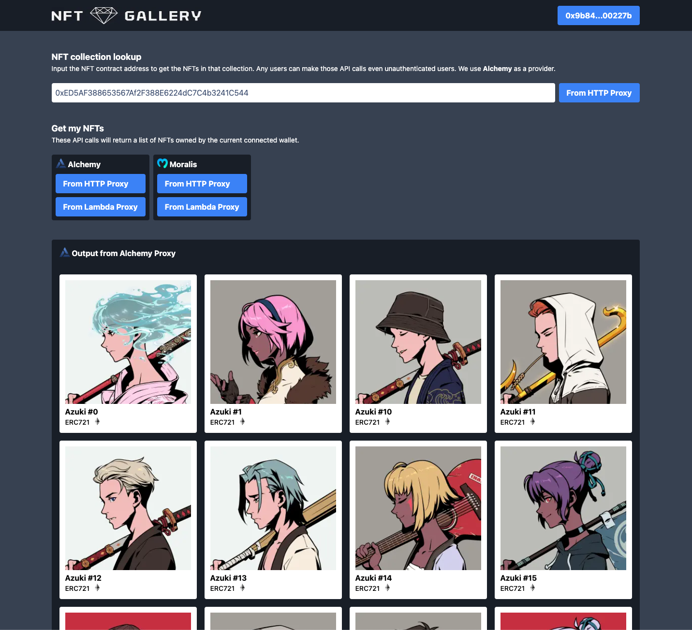

# NFT Gallery

This decentralized web application (dApp) permits users to display their own NFTs or any NFT collections on Ethereum. 
Any users can look up any NFT collections while Authenticated users can also look up their own NFTs.

Read this related AWS Blog post for more information: https://aws.amazon.com/blogs/architecture/dapp-authentication-with-amazon-cognito-and-web3-proxy-with-amazon-api-gateway/

# Overview

This demo demonstrates how you can use various AWS services to authenticate users with their digital wallet and make secure API calls to third party Web3 API providers like [Alchemy](https://www.alchemy.com/) and [Moralis](https://moralis.io/). 

You will learn how you can use [Amazon Cognito](https://aws.amazon.com/cognito/) to authenticate users using their digital wallet to obtain an identity and temporary AWS credentials to grant your front web application  access to the AWS services you need.

You will use an Amazon Cognito custom authentication challenge to ask users to sign a random message with their digital wallet. Amazon Cognito, by the way of [Lambda Triggers](https://docs.aws.amazon.com/cognito/latest/developerguide/cognito-user-identity-pools-working-with-aws-lambda-triggers.html), will validate if the signature is valid and will issue an ID token which proves that the user's wallet address has signed the given message with his digital wallet. 

You will also experiment with multiple ways to authorize access to [Amazon API Gateway](https://aws.amazon.com/api-gateway/) routes using Cognito Authorizers and [IAM Roles](https://docs.aws.amazon.com/cognito/latest/developerguide/iam-roles.html). You will also explore how to use Amazon Cognito IdentityPool to grant IAM Roles to authenticated and unauthenticated users thus securing your API to all users including anonymous users.

Finally, you will learn how to use API Gateway as proxy to third party Web3 APIs. In this case you will proxy calls to two Web3 providers, [Alchemy](https://www.alchemy.com/) and [Moralis](https://moralis.io/).

# Architecture 

# Deployment

First go to the `backend` folder, open the README there and deploy the architecture using [SAM](https://aws.amazon.com/serverless/sam/).

Then go to the `dapp` folder, open the README there and run the dApp locally.

# Inspiration

This work was inspired by: https://davbarrick.medium.com/how-to-build-a-serverless-web3-wallet-login-like-opensea-with-metamask-and-cognito-eb93c723f4de

# Thanks

[@the-rpc](https://github.com/the-rpc) for the code review and ReactJS expertise
